# OpenPayFit

This application was made following the guidelines of the statement provided

## App structure:

Architecturally, the application is made with **Clean Architecture** and **MVVM ViewModel's Centric** in the presentation layer (App)
Among other technologies used, it should be noted that:
- **Hilt** was used as a dependency injector and is implemented with a separate module for better concern handling
- For networking and downloading of images **Retrofit** and **Picasso** were used respectively
- To store information in a local database, **Room** was implemented
- To handle asynchronization, **kotlin coroutines** were used
- For the use of the camera, **CameraX** was used
- For the use of the map, **Google Maps** was used
- Finally, to carry out the unit tests, **MockK** was used

## Profile tab:
This tab requested: include information on the most popular user, where reviews can be viewed made by the user, and images.

In this tab, a card was implemented with the image and information of the most popular user provided by the endpoint `/person/popular` 
and below is the list with the shows (movies or series) for which he or she is recognized.

| Profile tab loaded                            | Profile tab empty state |
|-----------------------------------------------|-------------------------|
| 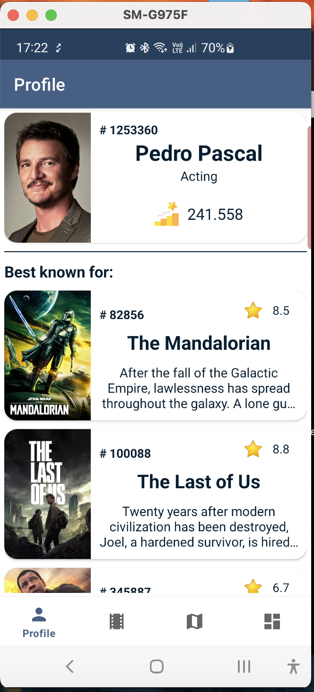 | 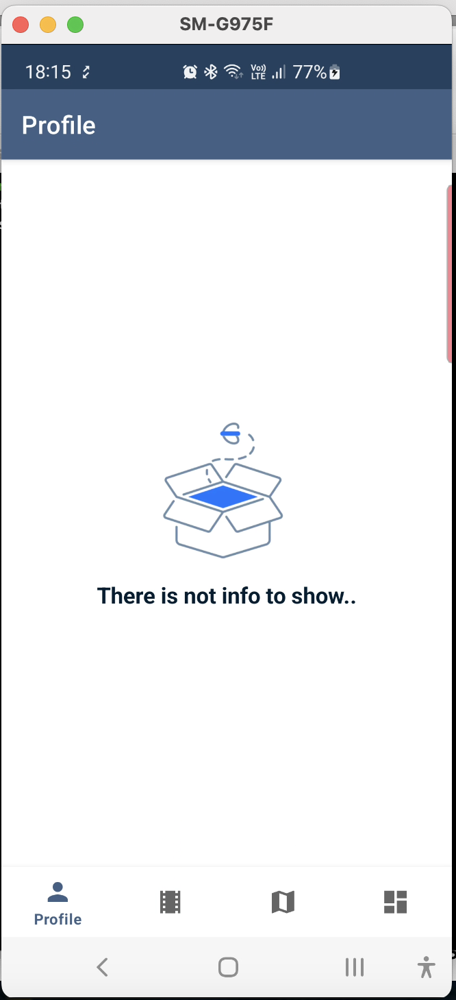 |

## Movies tab:
This tab requested: Load the list of all movies separated with the most popular movies, the most rated and the best recommendations.

In this tab, 3 calls to services were implemented:
- Popular movies: `/movie/popular`
- Top rated movies: `/movie/top_rated`
- Recommended movies: `/movie/{movie_id}/recommendations`

The UI is made with three expandable cards. Each card shows the information of the first movie in the list returned by the service and
when it is expanded (by clicking on the "See more" button), the list of all the movies in that section is displayed in the same visual
format.
In the case of recommended films, the recommended films are consulted for the film with the greatest popularity on the Top Rated list.

| Movies tab loaded                             | Movies tab expanded 01                        | Movies tab expanded 02                      | Movies tab empty state                     |
|-----------------------------------------------|-----------------------------------------------|---------------------------------------------|---------------------------------------------|
| 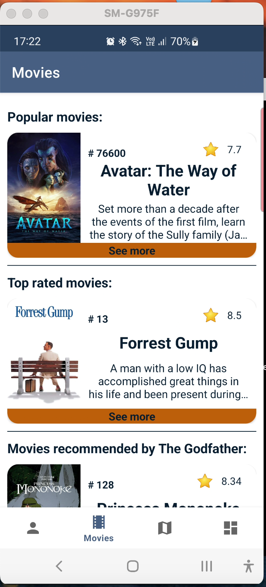 | 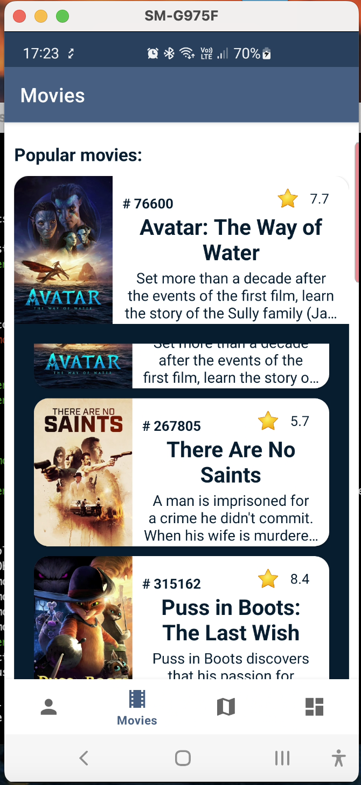 | 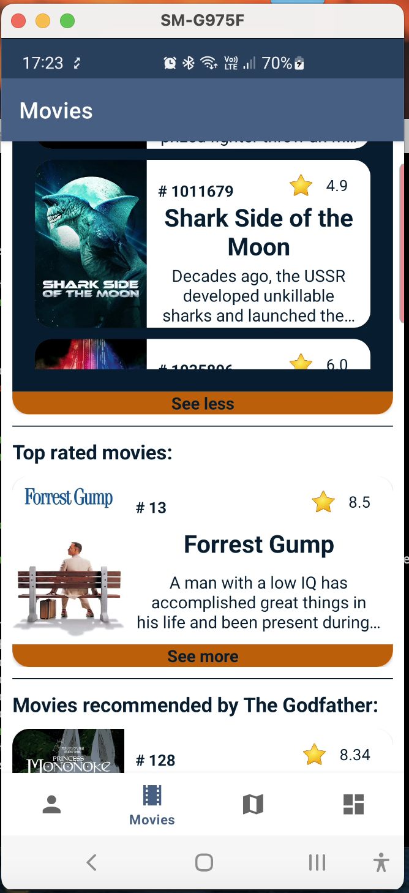 | 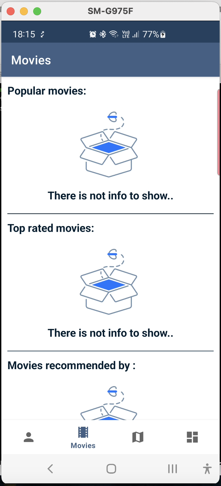 |

## Map tab:
This tab requested: Consume from the Firebase console (Cloud Firestore) and display the locations on a Map, additionally showing the
storage date.
Add the device location to a Firebase console to persist (Cloud Firestore) every 5 minutes and notify the user using NotificationCompat.

When the application starts, among other things, it checks/requests the location permission that the user grants to the application. It
also starts an alarm that will run in the background every 5 minutes. When this alarm is executed, through a BroadcastReceiver, we
collect the location of the user, it is saved in the Firebase Firestore and then a notification is sent informing what happened using 
NotificationCompat. It should be noted that this alarm will continue to work regardless of whether the app is open or not and as long as 
the OS does not kill the process.

Once the map tab is displayed, a map is loaded using Google Maps and a default location (coordinates 0.0, 0.0) is displayed while
consuming the list of locations, and their respective times, that were recorded in the Firebase Firestore. Once all the markers are 
painted on the map, a small animation is performed until they all enter the screen. If we click on any of the markers, we will be able 
to see the date and time that that location was collected.

| Map tab loaded                            | Map tab date                              | Firebase Firestores                                         |
|-------------------------------------------|-------------------------------------------|-------------------------------------------------------------|
| 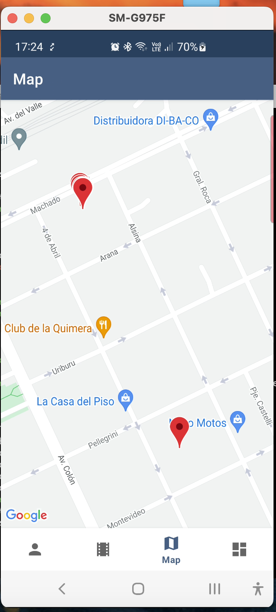 | 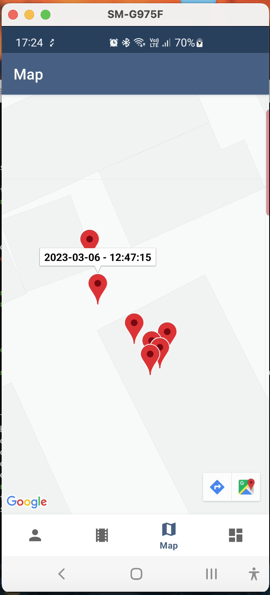 | 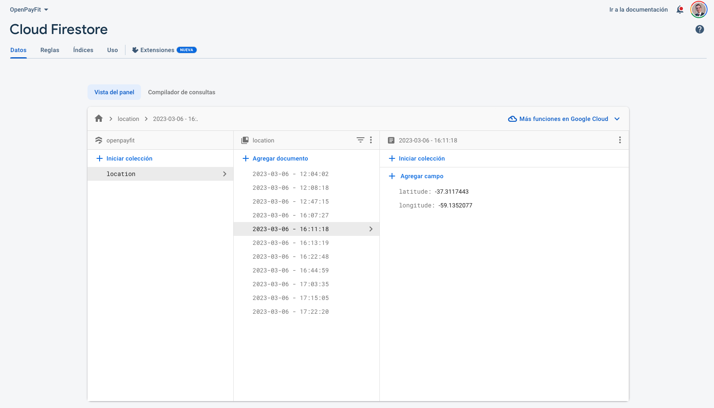 |

## Images tab:
This tab requested: Capture or select one or more images from the device's gallery and upload them to Firebase Storage.

In this tab, a list was implemented at the top in which the preview of the selected image(s) will be displayed. The user can get images
from his phone by pressing the "Gallery" button or take a photo with the phone's camera. For the use of the device's camera, CameraX was used.
Both the top preview list and the bottom counter will update as the user selects images. The selection made can be eliminated by 
clicking on the trash can.
Finally, if the user presses the "Save" button the selected images will be uploaded to Firebase Storage.

| Images tab empty                             | images tab loaded                            | Firebase Storage                                       |
|----------------------------------------------|----------------------------------------------|--------------------------------------------------------|
| 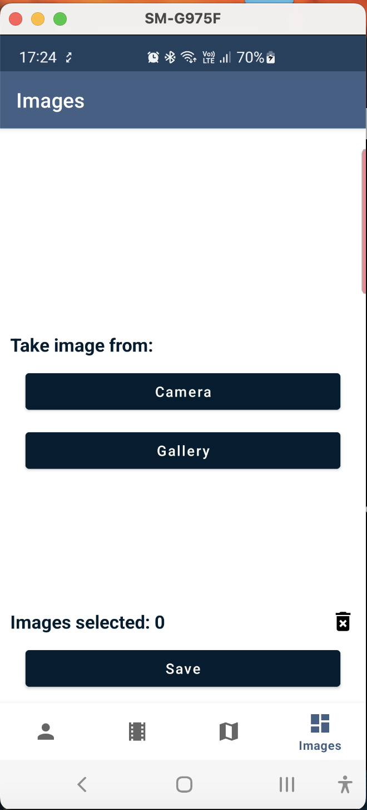 | 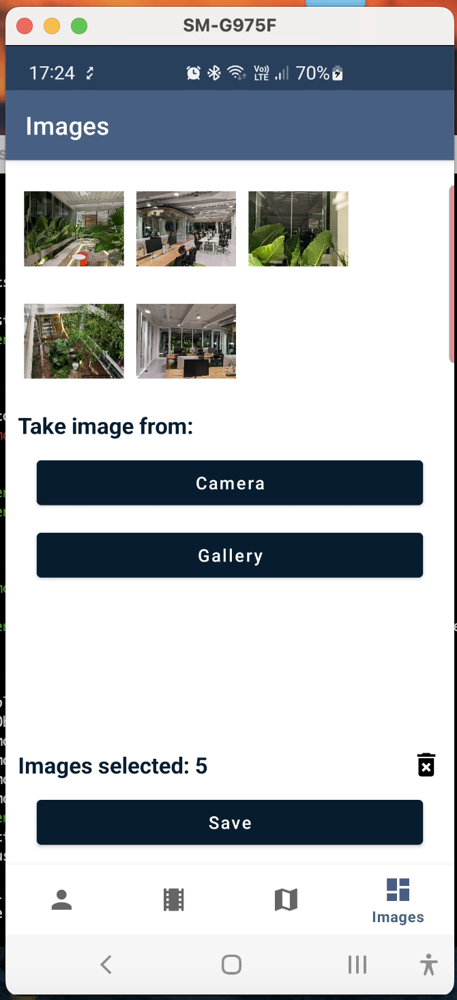 | 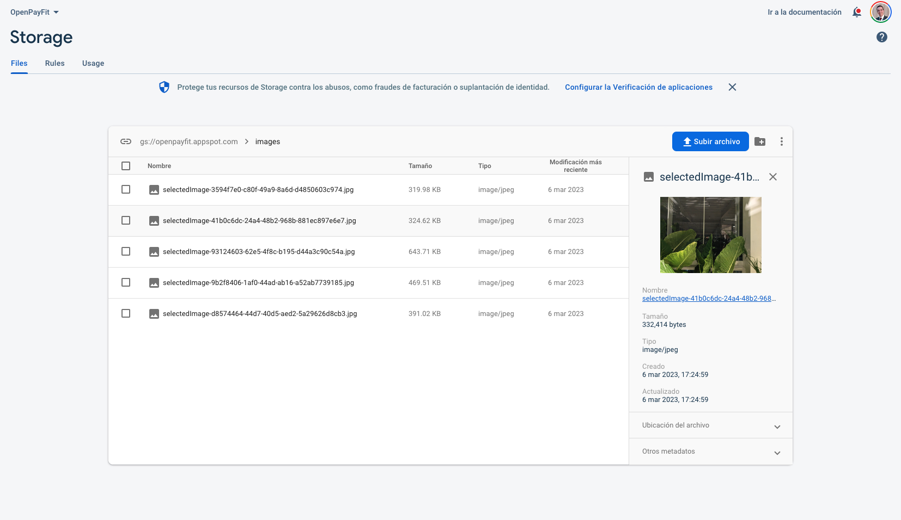 |

### General considerations:
Some general considerations were taken into account such as:
- Internet connection check
- Empty, Error and Loading states, when necessary
- Update of the information in the database whenever possible, although the information displayed in the application is
  always the one that is stored locally.
- Request for location and camera permits
- A friendly and intuitive UI

| Notification                                | Error Dialog                                |
|---------------------------------------------|---------------------------------------------|
| 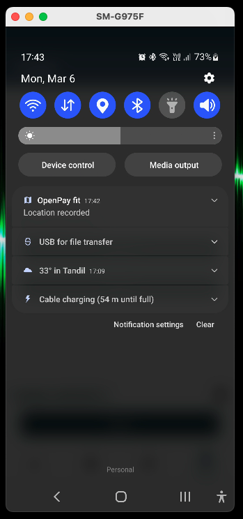 | 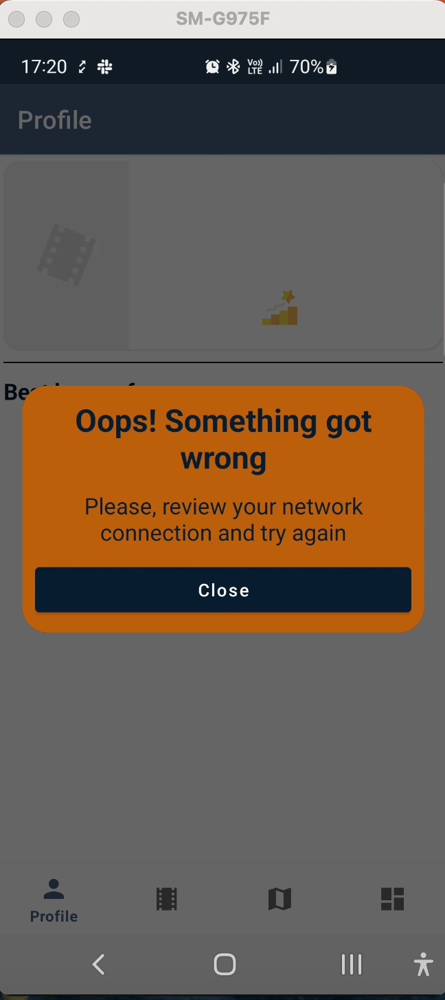 |

| Unit test                                   | Unit test Coverage                             |
|---------------------------------------------|------------------------------------------------|
| 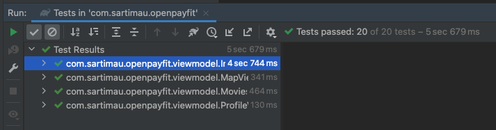    | 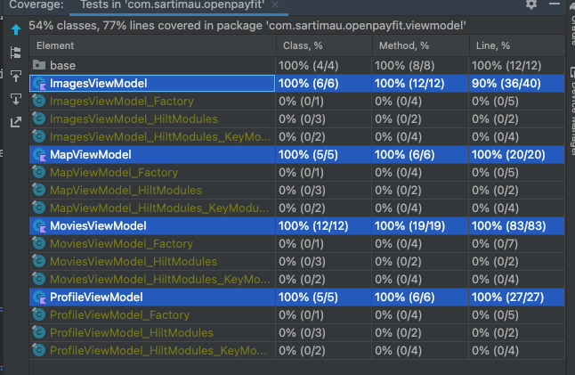     |
| 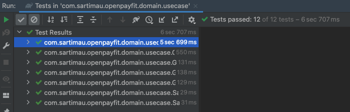 | 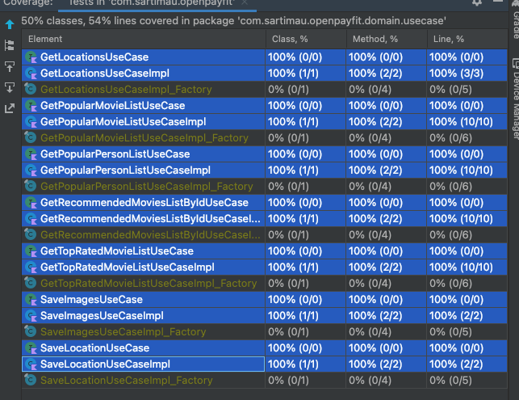 |

### DEMO video:

